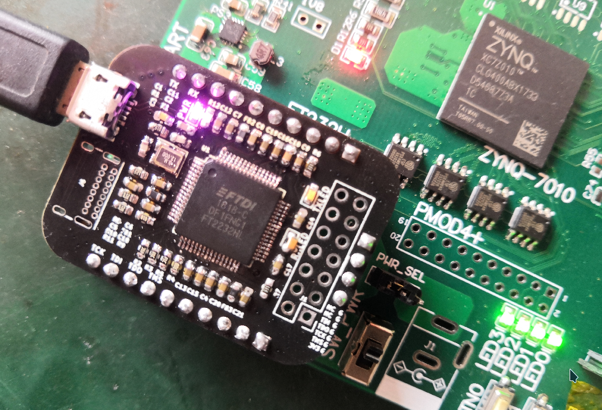
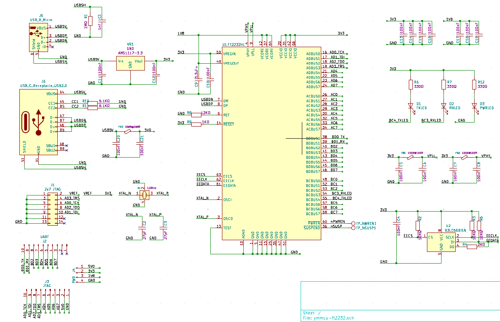
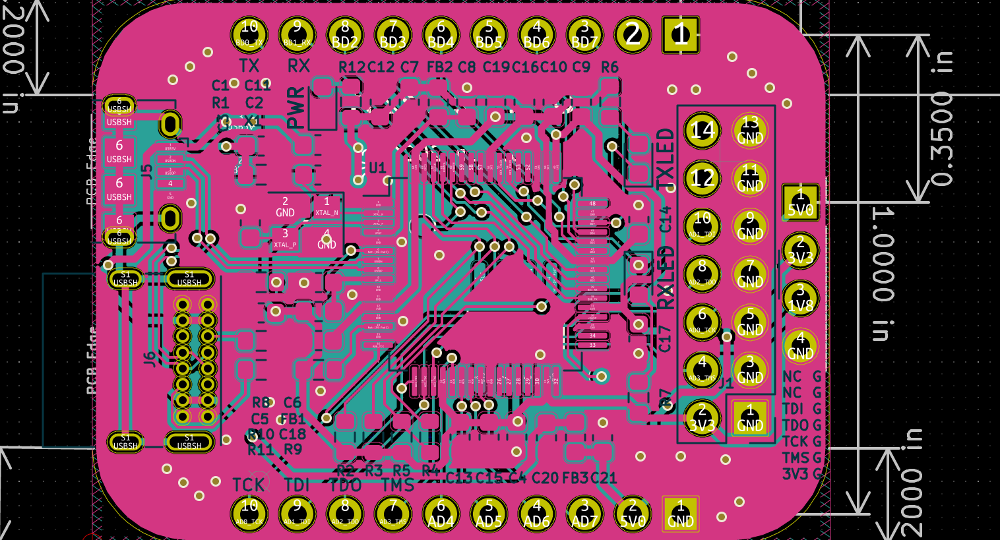
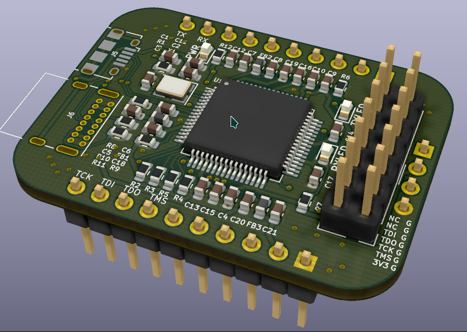

## YMMCU-FT2232HL

#### Function

Can be used as Xilinx JTAG download & USB-to-UART bridge simultaneously. 

Partly pin-to-pin compatible with the CJMCU FT232HL(the purple PCB one). 

Main chips: FT2232HL(QFP64), ASM1117(3.3V, SOT89), 93LC56(SOP8). 

Micro-USB + Type-C(untested) connection. 

Made with Kicad. 

#### Gallery

#### License

GPL-v3